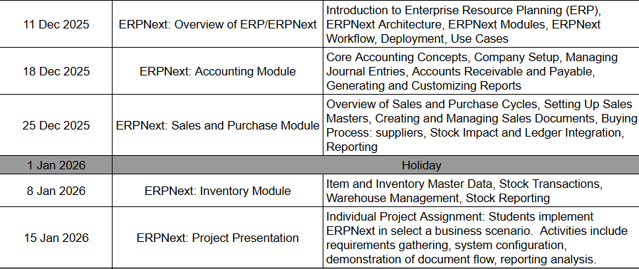
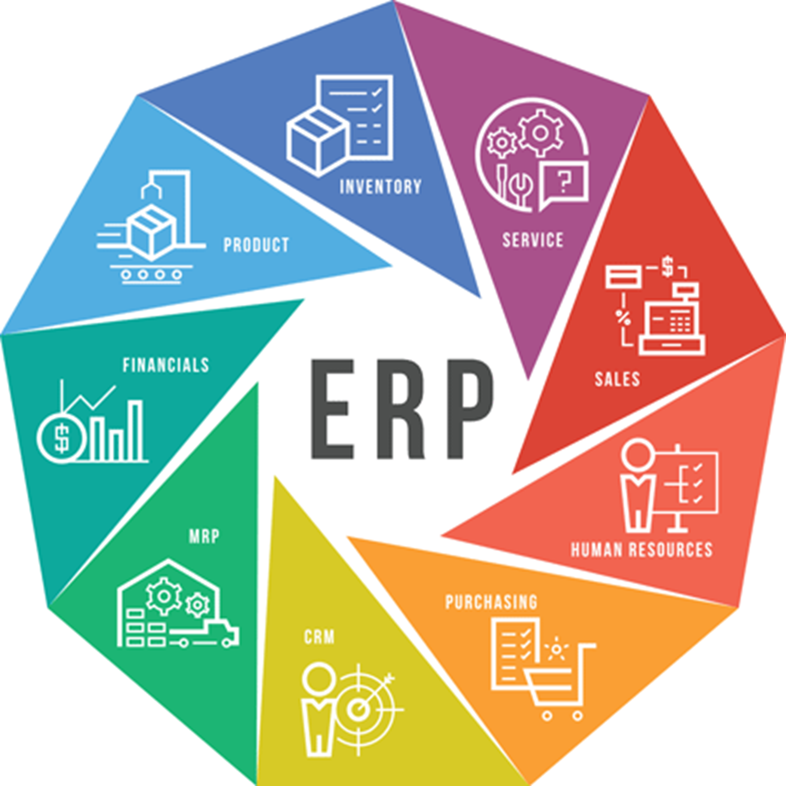
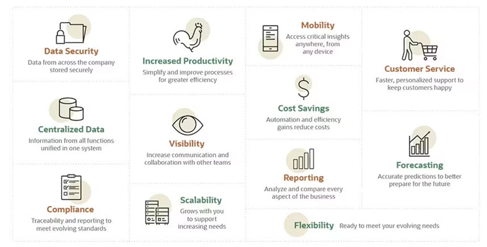
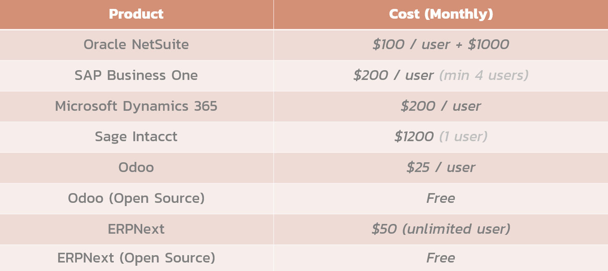
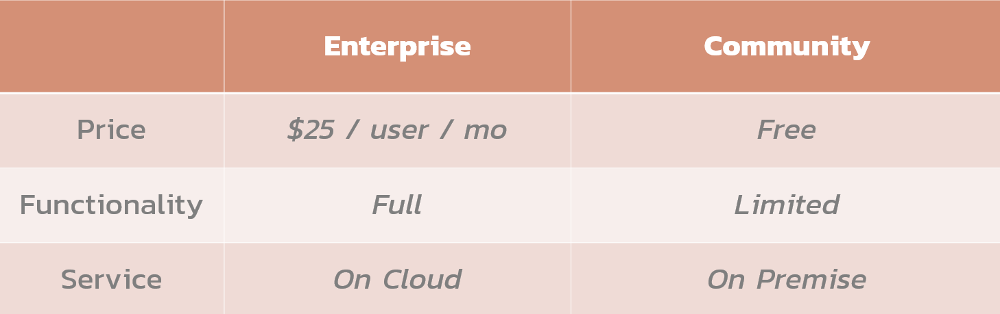
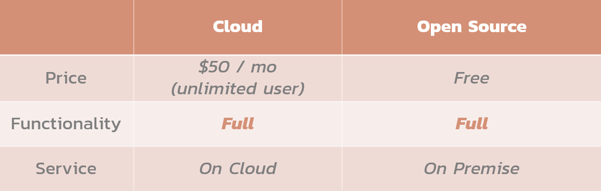
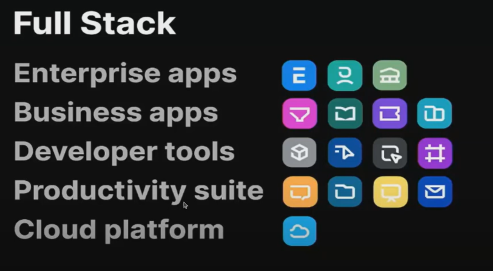

# Software for Accountancy

---

# Administration

- Instructor: Nirand Pisutha-Arnond
  - Faculty of Industrial Engineering Department
- Contact: Mango Canva, MS Team

---

# Schedule

---

# ERPNext

---

# What is ERP?

- Stands for _Enterprise Resource Planning_.
- Software that collects information from various departments in a common database
  - Unify critical business functions together.
  - Provide organization-wide visibility.

> Really complicated software

---

# Modules

---

# Standalone Software

---

# Standalone Software

---

# ERP vs Standalone Software

- ERP acts as a unified platform integrating multiple business processes
- Specialized software addresses only a single function or department.

> ERP enforces _process flows_ across business functions.

---

# Benefits of ERP

---

# Implementation Challenges

- Budget
  - License, operation cost, upgrade cost
- High learning curve
  - Need training, resistances to change
- Complex system
  - Need dedicated IT resource, capable vendor to maintain
- Non-standard processes / localization
  - Need a lot of customization (e.g. tax)

---

# ERP Products

---

# Odoo

---

# ERPNext

---

# Why ERPNext?

- 100% open source
- Extensive functionality
  - All areas covered (more or less)
  - Low Code / No Code
- Allow for easy customization

---

# Why ERPNext?

- Built on general-purpose framework
  - Frappe framework
  - Rapid development / customization
    Active development
  - Update every week

---

# Frappeverse

- Ecosystem of open-source products, frameworks, and community built around the Frappe Framework,

  - EERPNext as its flagship application.

- Checkout [Frappeverse Conference 2025](https://www.youtube.com/watch?v=ouC88s5G41U).

