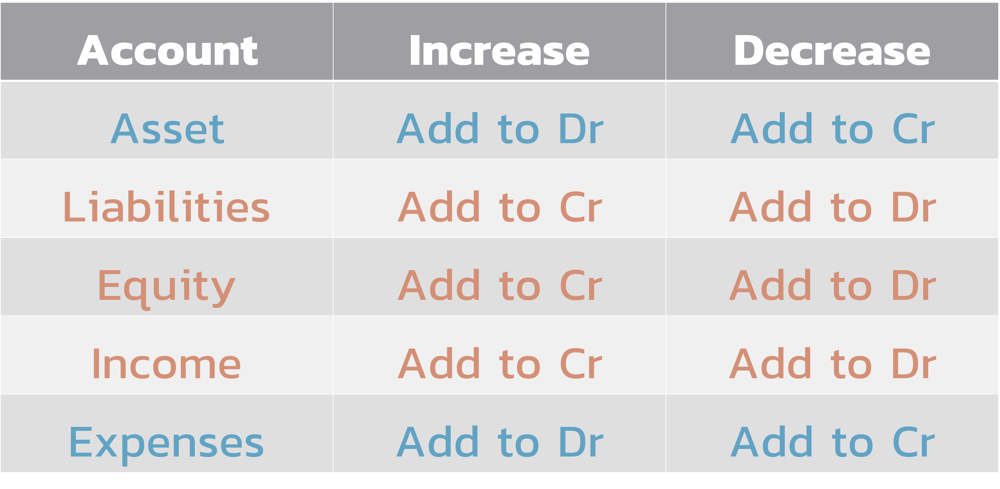
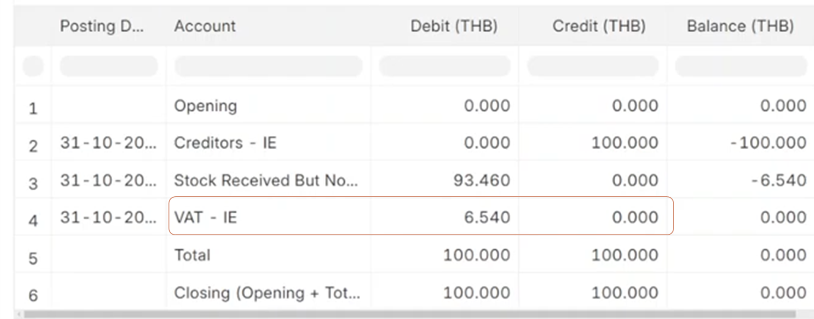
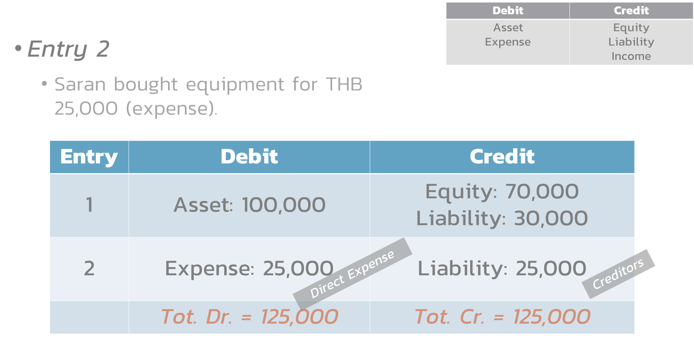

# Software for Accountancy

---

# ERPNext

> Accounting Module

---

---

# Type of Accounts

---

---

---

---

> You owe VAT less.

---

# Accounting Example

---

---

---

---

# Accounting

> Hand-on

---

# Hand-On

- Open a business
- Equity
  - John – 2000 THB
  - Mary – 3000 THB
- Expense
  - Rent - 500 THB
  - Salary – 200 THB
- Income
  - Service – 2000 THB

---

# Practice

- Mary
  - 3000
- Create another expense
  - Salary

---

# Financial Statements

- General Ledger: Transaction-level detail
- Balance Sheet: Assets, liabilities, equity snapshot
- Profit & Loss: Revenue and expense analysis
- Cash Flow: Liquidity tracking
- Trial Balance: Account verification
- Account Receivable: Customer debts
- Account Payable: Supplier debts
