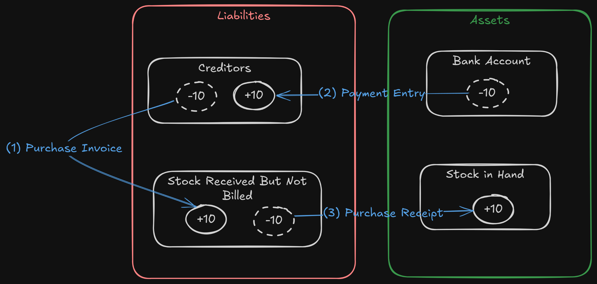
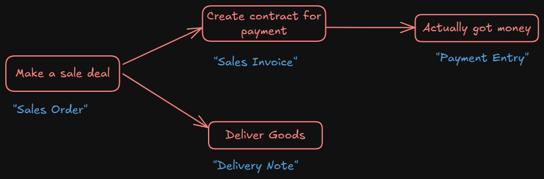
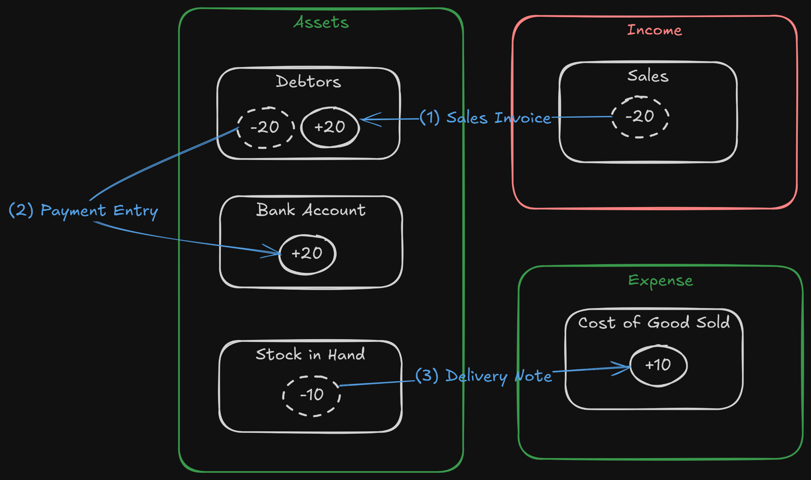
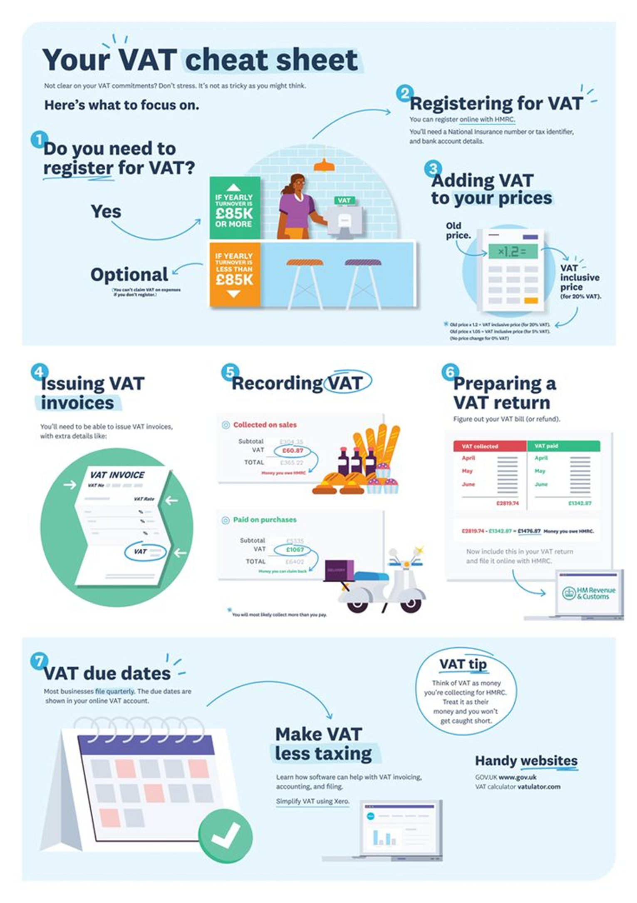
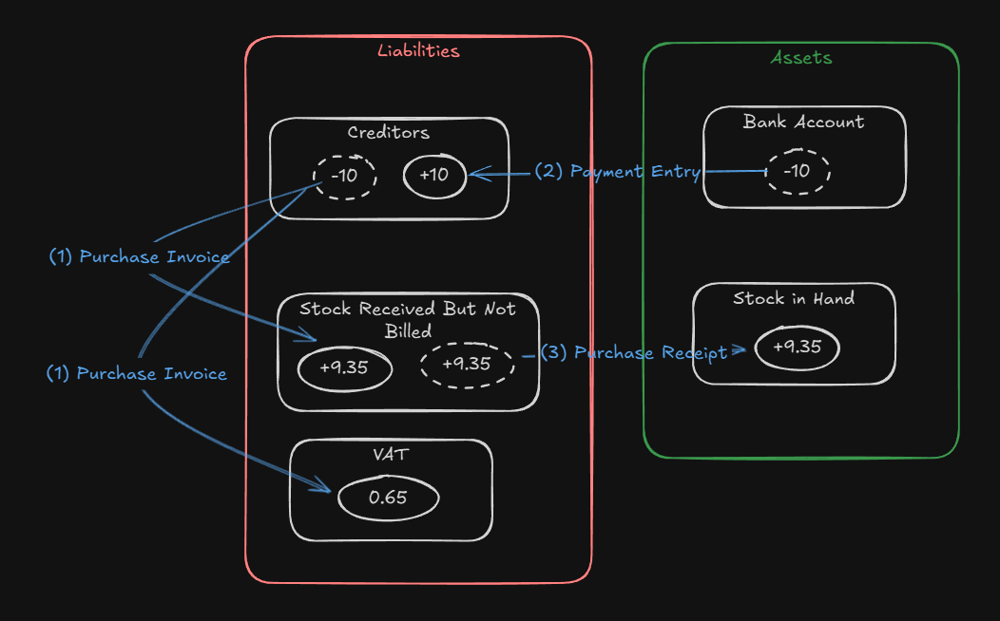
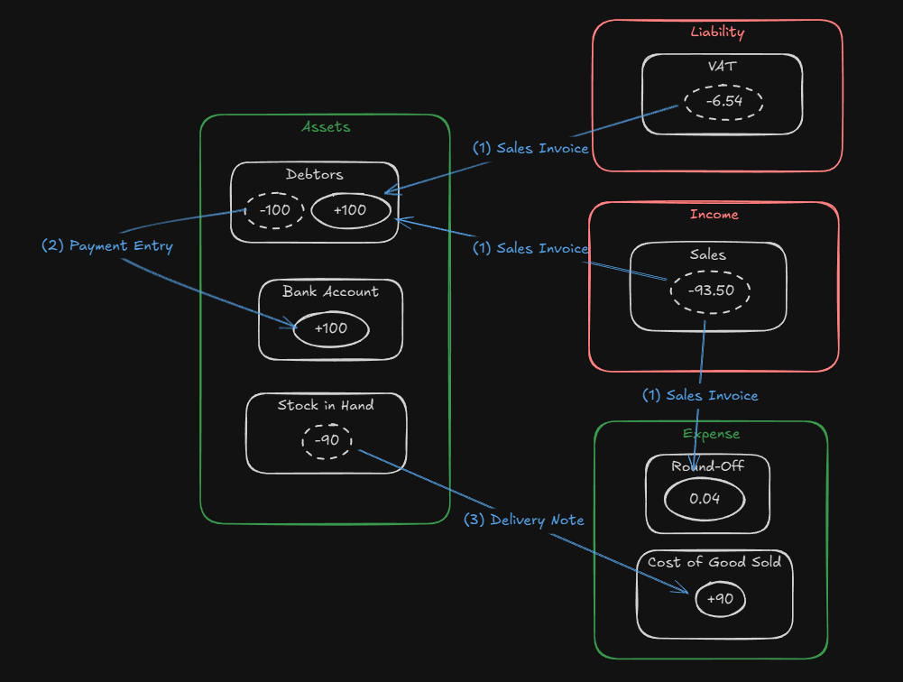

# Software for Accountancy

---

# Purchase Module

---

# Purchase Flow

---

# Practice

- Create pen item
- Create a supplier
- Buy 10 pen for 50 THB/pcs.

---

---

# Exercises (1)

- Purchase more pens.
- Purchase other items.
- You may create more supplier.

---

# Exercises (1)

- Buy 1,000 pens with two payments/deliveries
- Create 2 purchase invoices
  - 400 pens
  - 600 pens
- Create 2 purchase receipts
  - 400 pens
  - 600 pens

---

# Sales Module

---

# Sales Flow

---

# Practice

- Create `customer`
- Buy and sell more items until you have profit

---

---

# Sales and Purchase Tax

- Configure as **Taxes & Charges**.
- Types
  - VAT (Value Added Tax)
    - A multi-stage tax where businesses claim input tax credits
  - Sales Tax
    - Sales Tax hits the final consumer.

---

# VAT

---

# Purchase VAT

---

# Sale VAT

---

# Withholding Tax

- A tax deducted at source on certain types of payments such as professional fees, rent, interest, and dividends.
- The payer deducts the tax before making the payment to the payee and remits it to the tax authorities on behalf of the payee.
- The payee receives the net amount after the withholding tax deduction.
- The withheld amount can often be claimed as a credit against the payee's overall tax liability.

---

# Shipping Charge

- A cost associated with the delivery of goods to customers.
- Can be added to sales invoices as a separate line item or included in the total amount.
- Account associated with shipping should be income account for sales and expense account for purchases.

---

# Return

- Delivery Note Return
- Sales Invoice Return (Credit Note)
- Apply credit note during payment entry
  - Note that asset account is used instead of income account.

---

# POS

- Create a walk-in customer
- Create POS profile
- Create POS opening entry
- POS
- Close POS

---

# Cost Center

- An accounting dimension that helps you track and analyze financial performance within specific segments of your organization.
- Allows you to analyze financial performance at a more granular level.

---

# Period Closing Voucher

- A Period Closing Voucher indicates that the profit/loss for an accounting period has been balanced, and the books can start fresh.
- At the end of every year or (quarterly or maybe even monthly), after completing auditing, you can close your books of accounts.
