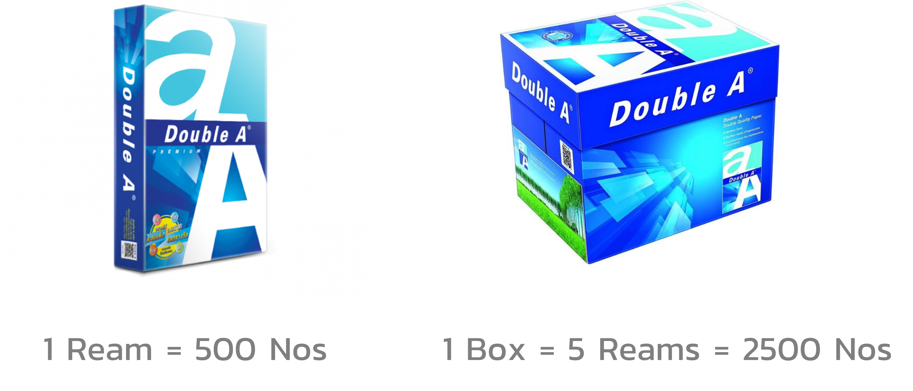

# Software for Accountancy

---

# Stock/Inventory Module

---

# Inventory Management

- Add new items
- Add more existing items
- Add new warehouses
- Move items between warehouses
- Issue items
- Dealing with batches and serial numbers

---

---

# Batch Code

`MARKER_.YY.MM.DD._.####`

---

# Manufacturing Module

---

# Manufacturing Process

- Create a Bill of Materials (BOM)
- Manufacture finished goods from raw materials
- Track production orders
- Manage work centers and labor
- Monitor production costs and efficiency
